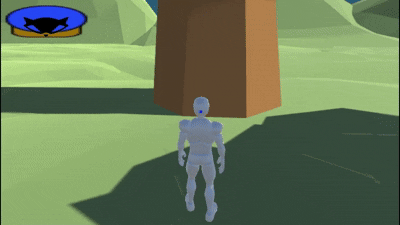
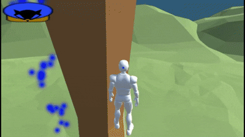

# Thievius

> 단순한 오브젝트 상호작용으로만 이루어져있는 게임

---

## 🕹️ 조작법

| 키 | 동작 |
|---|---|
| `WASD` | 이동 |
| `Left Shift` | 대시 |
| `G` | 액션 상호작용 |
| `E` | 아이템 획득 |
| `Tab` | 인벤토리 |
| `우클릭` | 3인칭 / 1인칭 전환 |

---

## ⚙️ 주요 기능
- 상호작용이 가능한 오브젝트의 가까이 가면 푸른색 파티클이 나타납니다.
  해당 상태에서 G키 입력시 해당하는 액션을 취하게 됩니다.

- Ladder 액션

- Perch 액션

